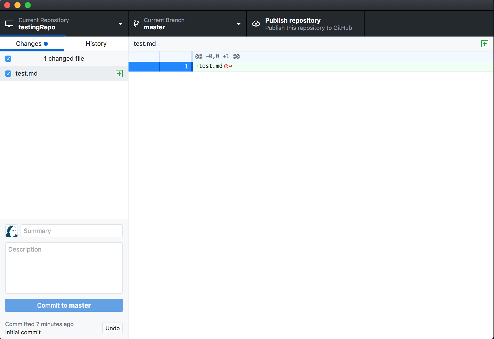
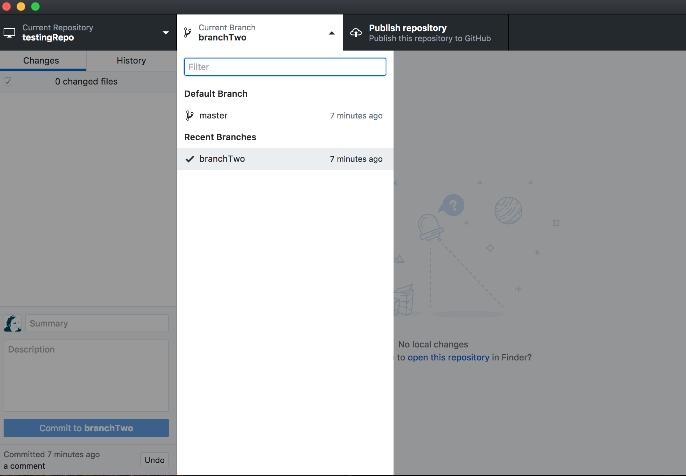
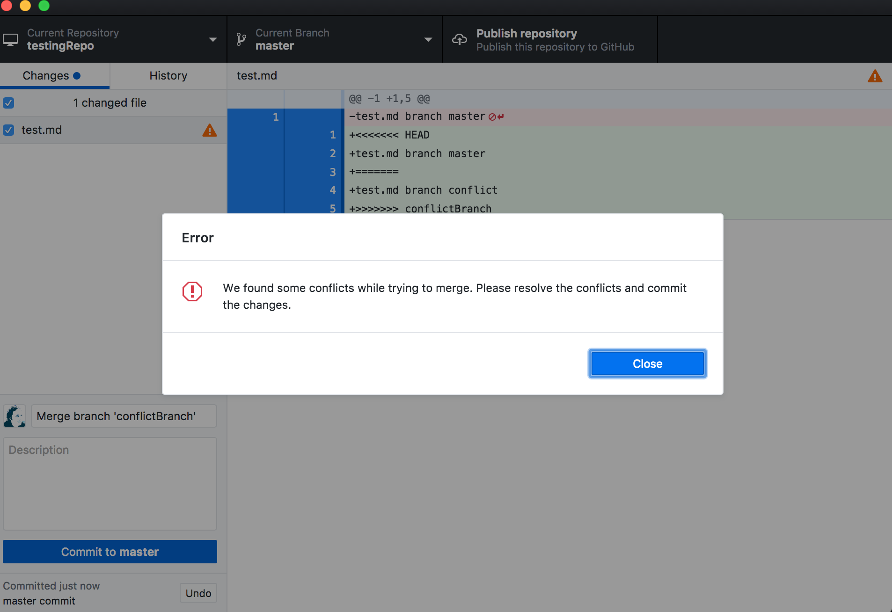

# GIT Tutorial

With Github Desktop (Beta version)

## Init

Make a new repository

Menu option File->New

Give it a name and choose a place for it

Click Create Repository Button


## Add Files

Add a file with some text editor, Vim, EMACS, Nano, Atom, Sublime Text, TextMate, SimpleText, etc

In the GUI interface, make sure you're in the repo you want to work with by using the top left area. Click to change



Below on the left, you'll see tabs for Changes and History. If you added files or made changes, you'll see the list of files mid-left

Add a comment for the commit in the summary field

Click Commit to master button. "Master" may change based on which branch you're editing

## Add Branch

Create a branch

Menu option Branch->New Branch

Middle-top of the window shows which branch you're working on. Clicking it will pop open a list of branches and permit you to change to another branch



Make sure you're in the new branch we just created

Edit the file and make a commit in this branch

## Merge into Master Branch

Now to add changes from some other branch into the Master branch.

Change to the master branch from that top middle branch selector option

Then, menu option Branch->Merge Into Current Branch...

Choose the branch to merge from

Click Merge into Master (or whichever branch your merging into) Button

If Master hasn't changed, then you're done

If you want to delete the branch you merged into master then change to that branch 

Menu option Branch->Delete

Confirm as this is not undo-able

## Conflict

If during the merge, GIT complains about conflicts, the you need to fix them. 



Edit the file in any text editor and look at where it's complaining. Somewhere in the file you'll see something like this:

```
>>>>>>> mergedIntoBranchName
merge into branch code
=======
merge from branch code
<<<<<<< mergedFromBranchName
```

This shows both branches code in one place. Starting with ">>>>>>> mergedIntoBranchName", separated by the "=======", ending with "<<<<<<< mergedFromBranchName", and you need to decide how to resolve this. 

Ultimately, you'll need to delete the wrapper text lines and leave what you want, so that could mean something that looks like this.

```
merge into and from branch code
```

Save. Commit. Rejoice. 

Voilá
